Recursive-IR is a single-binary orchestration that transforms an OpenSearch stack into a fully capable and customisable DFIR log analytics platform. Incident responders and digital forensics investigators can examine events arranged in a "super timeline" enabling correlation between different source artefacts to better understand the threat actor's full chain of attack.


Recursive-IR enables collaborative case-centric investigations with persistent enrichments such as tags, comments, and analyst context, while fully leveraging the strengths of OpenSearch and native OpenSearch Dashboards — scalable observability, visualisation, and Security Analytics for alerting and correlation across ingested forensic artefacts.

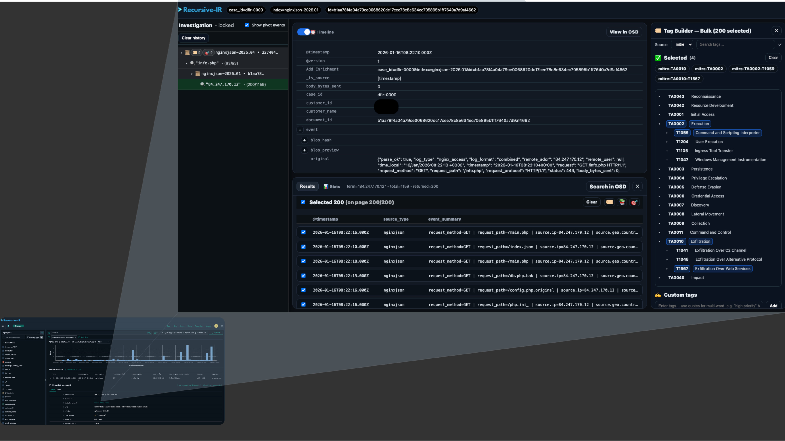


---

## Features 

1. Case-centric investigation - allows grouping of artefacts into individual cases.
2. Dynamically generate filebeat input config files, logstash pipelines, and OpenSearch index templates to facilitate forensics artefacts ingestion.
3. Orchestrate arbitrary parsers (e.g., hayabusa, dissect, plaso, evtx_dump,  etc.) to convert forensics artefacts into OpenSearch-ingestable jsonl format. 
4. Add persistent enrichments to events in OpenSearch such as tags and comments and automatically project them into OpenSearch Dashboards.
5. Group a specific set of events into "collections" and an easy toggle to add hand-picked events to the final investigation timeline.
6. Intuitive user interface for event enrichments, marking indicators of compromise, and pivoting during artefacts analysis (e.g., all searches are saved in a "pivot tree". 
7. Command-line interface, also exposed via web API endpoints.
8. Config-driven normalisation, e.g., copy, rename, stringify, blobify, derive, or drop fields.
9. Easily reload/re-ingest forensics artefacts along with any previously added enrichments.
10. Run ingested artefacts through OpenSearch Security Analytics plugin supporting native Sigma rules, for alerting and correlation during investigations.
11. Enrich events with geolocation data using Recursive-IR's own custom built mmdb database.

... more to come.


---

# 🚀 Quickstart

This guide walks through a **fresh single-node installation** of Recursive-IR on any Ubuntu installation (tested on Ubuntu Server 24.03).

An installer script called ```install_opensearch_stack.sh``` installs and configures:

- OpenSearch
- OpenSearch Dashboards
- Logstash
- Filebeat

The Web API and UI containers and OpenSearch Dashboards are all accessible through nginx which is also deployed via Docker container

---

## 1️⃣ Clone Recursive-IR

```bash
git clone https://github.com/improvisec/recursive-ir.git
cd recursive-ir
```

---

## 2️⃣ Install OpenSearch Stack (via apt)

```bash
sudo OPENSEARCH_INITIAL_ADDMIN_PASSWORD='StrongPasswordHere' \
  ./scripts/install_opensearch_stack.sh
```

This installs and configures:

- OpenSearch (single-node, bound to `127.0.0.1`)
- OpenSearch Dashboards (loopback only)
- Logstash
- Filebeat 

---

### 📁 Stack Directory Layout

After installation, the core components live in the following locations:

#### 🔎 OpenSearch

| Path | Purpose |
|------|---------|
| `/var/lib/opensearch/` | OpenSearch data directory |
| `/var/log/opensearch/` | OpenSearch logs |
| `/etc/opensearch/` | OpenSearch configuration |
| `/etc/recursive-ir/certs/opensearch/` | TLS certificates (CA, node, admin) |

OpenSearch listens on:

```
https://127.0.0.1:9200
```

---

#### 📊 OpenSearch Dashboards

| Path | Purpose |
|------|---------|
| `/etc/opensearch-dashboards/` | Dashboards configuration |
| `/var/log/opensearch-dashboards/` | Dashboards logs |

Dashboards listens on:

```
http://127.0.0.1:5601
```

External access is handled by nginx (accessible via OSD_HOST_LAN).

---

#### 🔁 Logstash 

| Path | Purpose |
|------|---------|
| `/usr/share/logstash/` | Logstash binaries
| `/etc/recursive-ir/logstash/` | Recursive-IR Logstash pipelines + config |
| `/var/lib/recursive-ir/logstash/` | Logstash data + dead letter queue |
| `/var/log/recursive-ir/logstash/` | Logstash logs |

---

#### 📦 Filebeat 

| Path | Purpose |
|------|---------|
| `/usr/share/filebeat/` | Filebeat binaries
| `/etc/recursive-ir/filebeat/` | Recursive-IR Filebeat input files + config|
| `/var/lib/recursive-ir/filebeat/` | Filebeat registry/state |
| `/var/log/recursive-ir/filebeat/` | Filebeat logs |

---

#### 🗂 Recursive-IR 

| Path | Purpose |
|------|---------|
| `/etc/recursive-ir/` | Main configuration directory |
| `/etc/recursive-ir/conf/recursive.env` | Runtime environment configuration |
| `/etc/recursive-ir/filebeat` | Filebeat input configuration files |
| `/etc/recursive-ir/logstash` | Logstash pipeline configuration files |
| `/var/log/recursive-ir/cases/` | Main artefacts storage (raw + jsonl-converted |
| `/var/lib/recursive-ir/` | Jobs database |

---

#### 🔐 TLS Certificates

All OpenSearch TLS materials are stored under:

```
/etc/recursive-ir/certs/opensearch/
```
---

## 3️⃣ Bootstrap Recursive-IR
After recursive-ir has been bootstrapped, ./bin prefix is no longer needed when running dfir commands.

```bash
sudo ./bin/dfir init --bootstrap-env --enable 
```

This initializes Recursive-IR services, databases, and default configuration files (/etc/recursive-ir/conf/)

The following services will also be installed:

1. dfir-watcher - Watches folders for any artefacts dropped into:

```
 /var/log/recursive-ir/cases/<case_id>/hosts/<host_ip>/inbox
```
and routes them into:

```
 /var/log/recursive-ir/cases/<case_id>/hosts/<host_ip>/raw_artefacts/<source_type>
```

2. dfir-parser - Watches files from the raw_artefacts/<source_type> folder above and runs corresponding parsers that will convert them into jsonl format. All jsonified_artefacts/<source_type> folders are monitored by Filebeat and jsonl files are fed into Logstash for OpenSearch Ingestion:

```
 /var/log/recursive-ir/cases/<case_id>/hosts/<host_ip>/jsonified_artefacts/<source_type>
```

3. dfir-enricher - Runs periodically to see if there are any enrichments in the database that need to be projected into OpenSearch. This allows the enrichments such as tags and comments to persist (e.g., during case reloads).

```
/var/log/recursive-ir/cases/<case_id>/enrichments/data.mdb
```

4. dfir-worker - Constaintly monitors the database for new jobs submitted via the API through the Web UI.

```
/var/lib/recursive-ir/web/jobs.db
```

---

## 4️⃣ Configure Environment

Edit:

```bash
sudo nano /etc/recursive-ir/conf/recursive.env
```

Update:

```bash
OS_USER="admin"
OS_PASS="CHANGE_THIS"

# LAN host/IP used for UI + OSD deep links
OSD_HOST_LAN="http://<your-server-ip>"
```

⚠ Replace `<your-server-ip>` with the actual IP or hostname of your server.

| Variable | Description |
|----------|------------|
| `OS_HOST` | Internal OpenSearch endpoint (loopback) |
| `OSD_HOST` | Internal OpenSearch-Dashboards (loopback) |
| `OSD_HOST_LAN` | Public host/IP users will access via nginx |

---

## 5️⃣  Deploy Recursive-IR Web UI, API, and Nginx Docker containers 

Recursive-IR web components run in Docker.

---


```bash
sudo apt-get update
sudo apt-get install -y ca-certificates curl gnupg
sudo install -m 0755 -d /etc/apt/keyrings
curl -fsSL https://download.docker.com/linux/ubuntu/gpg |   sudo gpg --dearmor -o /etc/apt/keyrings/docker.gpg
sudo chmod a+r /etc/apt/keyrings/docker.gpg
echo   "deb [arch=$(dpkg --print-architecture) signed-by=/etc/apt/keyrings/docker.gpg] \
https://download.docker.com/linux/ubuntu \
$(. /etc/os-release && echo "$VERSION_CODENAME") stable" |   sudo tee /etc/apt/sources.list.d/docker.list > /dev/null
sudo apt-get update
sudo apt-get install -y   docker-ce   docker-ce-cli   containerd.io   docker-buildx-plugin   docker-compose-plugin

cd web
docker compose --env-file /etc/recursive-ir/conf/recursive.env up -d --pull always
```
This starts:

- FastAPI backend
- Recursive-IR Web UI
- Nginx reverse proxy
(Note: Nginx is required to access OpenSearch Dashboards from the network)
---

## 6️⃣ AccessRecursive-IR (OpenSearch Dashboards)

From another machine on the network, type this on your browser in order to access Recursive-IR (OpenSearch Dashboards). Use "admin" as the username and the password set in OPENSEARCH_INITIAL_ADMIN_PASSWORD during the initial installation of OpenSearch stack.

```
http://<your-server-ip>/
```
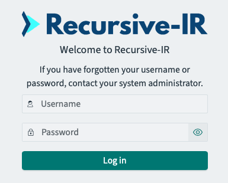

The nginx gateway proxies connections to the following:

- OpenSearch Dashboards → `/`
- Recursive-IR UI → `/recursive-ir/`
- Recursive-IR API → `/recursive-ir/api/v1`

After logging in, a tenant selection will be presented. Global tenant is the main investigation workspace for the admin user. Non-admin users also has access to the same Global tenant but can only make modifications in their own Private tenant (e.g., creating saved searches, visualisations, and dashboards).


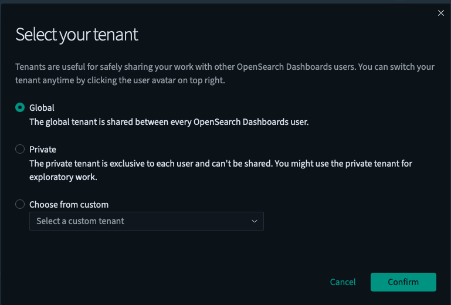

---

# 🔎 Verify Full Stack

Check system services:

```bash
systemctl status opensearch opensearch-dashboards logstash filebeat dfir-watcher dfir-parser.timer dfir-enricher.timer dfir-worker
```

Check Docker containers:

```bash
docker ps
```

Check OpenSearch:

```bash
curl --cacert /etc/recursive-ir/certs/opensearch/root-ca.pem \
  -u admin:StrongPasswordHere \
  https://127.0.0.1:9200/_cluster/health?pretty
```

---

# ✅ Installation Complete

Your Recursive-IR deployment now includes:

- Secure OpenSearch (loopback only)
- Log ingestion via Logstash + Filebeat
- Recursive-IR worker + enrichment engine
- FastAPI backend
- React Pivot + Enrichment UI
- nginx LAN gateway for controlled access

---

# 📘 User Guide

Recursive-IR is currently actively being developed. As such, all CLI commands listed below will have a corresponding API endpoint accessible via the web UI. Type ```dfir | dfir [cmd] -h``` to see the help menu. 

---

## ➕ Add a New Parser (CLI)

The first step in using the platform is adding new parser definitions. By default, Recursive-IR ships with a number of sample parsers, that can be enabled by modifying the enabled setting in:

```
/etc/recursive-ir/conf/parsers.yml
```

An example parser command that adds a parser definition to convert EVTX logs into jsonl format is shown below:

```bash
dfir parser new -t evtx --patterns "*.evtx" --bin evtx_dump --args '-o,jsonl,--no-confirm-overwrite,-f,{out},{in}' -f
```
The command above means that any file in *.evtx format shall be handled by the program evtx_dump (parsers can be found or put into bin/ folder of the recursive-ir repository for convenience). The command above will create the following entry in parsers.yml (if it doesn't exist yet).

```
  evtx:
    enabled: true
    patterns: ["*.evtx"]
    bin: evtx_dump
    args: ["-o", "jsonl", "--no-confirm-overwrite", "-f", "{out}", "{in}"]
    route_mode: walk
    inherit_type: false
    expand_archives: top
    id: 100
```

Parser concepts:

- `enabled` - Whether the dfir-parser will activate the parser to perform jsonl conversion
- `patterns` - For individual files, globbing patterns are allowed. For artefacts inside folders, exact folder name must be specified
- `bin` - the name of the program to run to perform the parsing or jsonl conversion.
- `args` - a comma-separated list of arguments that the dfir-parser service will pass into the parser program when spawning it.
- `route_mode`: [walk|bundle] - whether the individual files will be recursively processed and fed into the parser program or the whole folder will be handed over.
- `inherit_type` - If a folder contains different types of artefacts, and you want to process them under a specific parsers.yml entry, set this to true. Otherwise, all parsers.yml entry that matches the patterns of each file will activate. For example, dropping an *.evtx will trigger both evtx_dump and hayabusa parsers.
- `expand_archives` - Automatically expand supported archives (tar/gz/zip).
- `id` - an auto-generated parsers entry id.
- `{in}` - A placeholder that will be replaced by the artefact file/folder being parsed.
- `{out}` - A placeholder for output jsonl file (e.g., Security.evtx.jsonl)


After a parser entry is created, several things happen behind the scene. Configuration files such as filebeat inputs, logstash pipelines, and opensearch index templates, etc. are created automatically. This allows recursive-ir to ingest practically any type of forensics artefacts as long as they are in jsonl format, without shipping any vendor-specific normalization pipelines. The following files and folder contents are modified:

Parser definitions:
```
/etc/recursive-ir/conf/parsers.yml
```
Custom field mappings definition:
```
/etc/recursive-ir/conf/field-mappings.yml
```
Filebeat input configuration file:
```
/etc/recursive-ir/filebeat/inputs.d/<source_type>.yml
```
Logstash pipeline configuration file:
```
/etc/recursive-ir/logstash/pipelines.yml
/etc/recursive-ir/logstash/pipelines/nnn-<source_type>.conf
```


---

## 📂 Create a New Case
Events in the Recursive-IR OpenSearch Dashboard can be grouped logically into different cases. Each event will have a case_id associated with it that can be used for filtering. This allows forensics investigator and incident responders to work on multiple cases, although a dedicated box is still recommended for complete isolation. The following command creates a new case.


```bash
dfir case new -c <customer_name> -z <timezone> 
```

This will:

- Create case folder structure inside ```/var/log/recursive-ir/cases/<case_id```
```
/var/log/recursive-ir/cases/
└── dfir-nnnn/
    ├── hosts/
    ├── enrichments/
    └── case_manifest.json
```
- Initialize case manifest that will be ingested into OpenSearch.
- Creates additional timestamp_<timezone> field that is useful if the investigation involves multiple timezones (e.g., either the artefacts sources or the analysts working on the case).

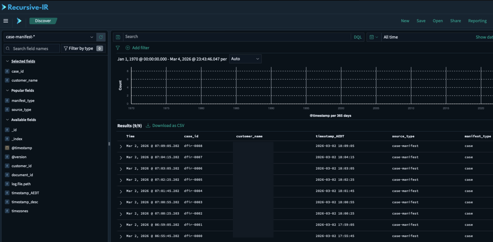

---

## 🖥 Add a Host into a Case
Every case will contain one or more hosts where artefacts will be dropped for ingestion. Similar to the case creation, adding a new host creates the metadata file that will be ingested into OpenSearch. Artefacts dropped into the host's inbox folder will also have the host_ip field created that can be used to identify all events belonging to a particular host. If an artefacts source does not have an IP address (e.g., cloud-related artefacts, any IP address can be specified (e.g., 127.0.0.1) just for tracking. The following excample command adds a new host to an existing case (only case_id and ip are mandatory, see -h for details):


```bash
dfir host add -c dfir-0001 --ip 192.168.0.1 --hostname host1.local --os Windows11
```

The command above will perform the following:

- Create the necessary directories for artefacts ingestion.
```
/var/log/recursive-ir/cases/
└── dfir-0001/
    ├── hosts/
    │   └── 192.168.0.1/
    │       ├── inbox/
    │       ├── raw_artefacts/
    │       │   ├── [<source_type>/,...]
    │       ├── jsonified_artefacts/
    │       │   ├── [<source_type>/,...]
    │       └── host_manifest.json
    └── case_manifest.json
```
- Initialize a host manifest that will be ingested into Opensearch. 

---

## 📥 Drop Artefacts into a Host's Inbox

Once the host has been created, artefacts can now be dropped into that host's inbox folder in:

```
/var/log/recursive-ir/cases/<case_id>/hosts/<host>/inbox/
```

The dfir-watcher service automatically:

- Detects artefacts dropped into the inbox folder .
- Routes them to the appropriate raw_artefacts/<source_type/ folder according to the parsers.yml entries.
- Maintain the folder hierarchy of dropped artefacts as much as possible.

The dfir-parser service will automatically:
- Detect artefacts dropped into the raw_artefacts/<source_type/ folder.
- Spawn child process to run and parse the artefacts according to the parsers.yml entries.
- Write the resulting jsonl file into jsonified_artefacts/<source_type/. Filebeat constantly monitors these folders, so it can hand over the events to Logstash for ingestion into OpenSearch.

---

## 👤 Create a new New User

To access the Recursive-IR's OpenSearch Dashboards, a user can be created using the following command.

```bash
sudo dfir user allow bob@example.com --os-create --print-password
```

This will:

- Create an OpenSearch internal user named 'bob@example.com'
- Authorize the user to access events enrichment UI and add enrichments to the OpenSearch events via "Add_Enrichment" field.
- Print the user's password on the terminal (optionally send via email (note: this feature is a work in progress but sending an email via Microsoft Entra registered app is supported).

Note: Recursive-IR's Web UI and API lives on the same box as OpenSearch and OpenSearch Dashboards, hence, the authentication tokens are shared between them allowing seemless integration.

---

# 🔎 Enriching Events

Recursive-IR uses field value type "URL" to add a clickable link on the "Add_Enrichment" field, that when clicked, will take the user to the enrichment UI where the user can pivot from (e.g., perform additional searches after inspecting the event), add enrichments such as tags, comments, collections, IOCs, and timeline. 

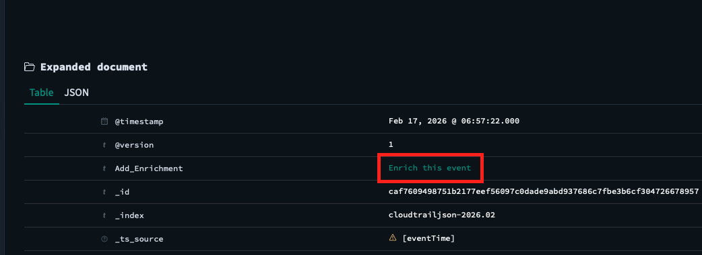

All enrichments will be created in the form of additional fields added into the OpenSearch event or document. The following fields contain these enrichments:

- ```tags``` - an array of strings. In the UI, pre-defined tags are created by creating .yml files in ```/etc/recursive-ir/conf/tags/```.  

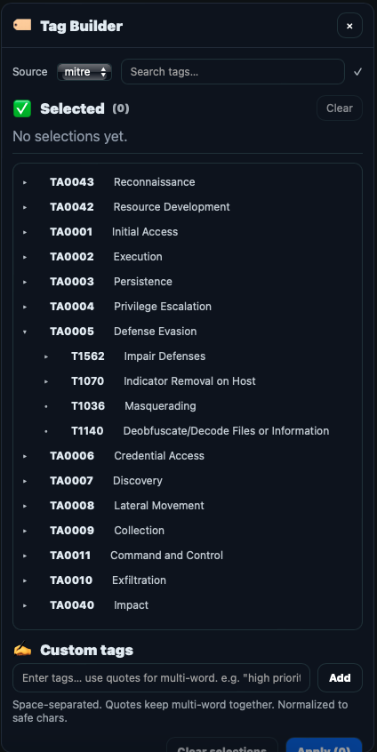

- ```event.iocs``` - an array of indicators of compromise (iocs)
IOCs can be marked by highlighting any string on the pivot event panel and accessing the right click context menu or clicking on the automatically highlighted pills.

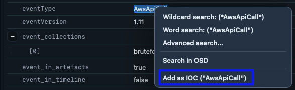

- ```event_collections``` - an array of collection names which the event is associated with. For example, a 1500+ failed logon events can be added to the collection "bruteforce_attacks" but only the initial, and successful ones are added into the Timeline.

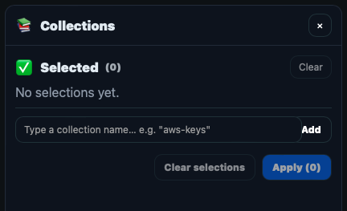

- ```event_in_timeline``` - created by toggling the "Timeline" slider on the pivot event. This is useful for maintaining a highly currated list of events that ultimately go into the investigation's timeline (and into your report).
- ```event_in_artefacts``` - system generated field that gets created depending on the user's enrichment actions (e.g., adding IOCs, adding to Timeline, etc.). 

The Enrichment panel in the enrichment UI is located on the right side and shows the existing enrichments that were added to the event.

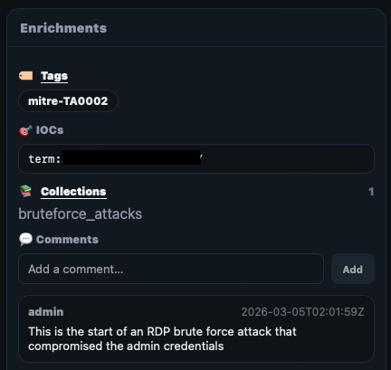

Certain enrichments can be added in bulk such as tags, iocs, and collections by accessing the enrichments button within the search panel.

---

## 🔍 Pivoting from the event by searching for specific terms

From Pivot event, a any string can be highlighted in order to access the search context menu (similar to when adding IOCs). The following explains the different search modes:

- Wildcard search (`.wc` fields) - A search for *search_term* anywhere in the field. This is the most accurate search but is slightly slower than word search. 
- Word search - A search for "search_term" using Opensearch's text analysers where fields are broken down into tokens to perform lighting fast searches. This is achieved by creating a "reverse index" mapping each token into events where such token appears.
- OpenSearch Discover deep-link - Takes the user back to OpenSearch Dashboards' Discover to perform the search there.

Both wildcard and word searches can be performed in the advanced search modal:

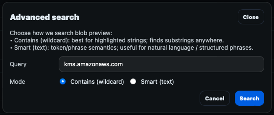

When a search is performed, the search panel results appear at the bottom and individual events can be selected to perform bulk enrichments action. To inspect the search results, an event_summary is displayed in the table. The fields included in the event_summary are constructed during the ingestion time by combining the fields specified in ```/etc/recursive-ir/opensearch-dashboards/columns.yml``` under a source_type entry. 

Note: Search feature is currently a work in progress to add features such as paging, enriching "all" events (as opposed to the preview list).

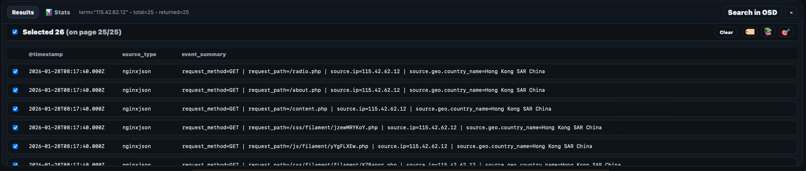

To make the search results more useable for analysis (e.g., to filter out noise in your data), access the stats panel and create statistics summary for a target field's values and add selected values as either include or exclude filter. Applying the filters will update the search result panel.


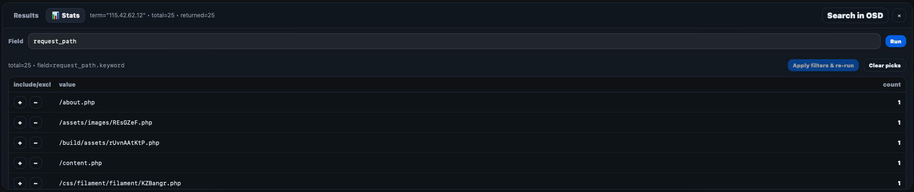


---

# 📁 Directory Layout

---

## Configuration Files

```
/etc/recursive-ir/conf
├── recursive.env
├── parsers.yml
├── field-mappings.yml
├── timestamps.yml
├── tags/xxx.yml

/etc/recursive-ir/
└── filebeat/inputs.d/
└── logstash/pipelines/
└── opensearch/templates
└── opensearch-dashboards/
```

## Case Artefacts

```
/var/log/recursive-ir/cases/
└── <case_id>/
    ├── hosts/
    │   └── <host_ip>/
    │       ├── inbox/
    │       ├── raw_artefacts/
    │       ├── jsonified_artefacts/
    │       └── host_manifest.json
    │       └── artefacts_manifest.json
    └── enrichments
    └── case_manifest.json
```

---

# 🛠 Troubleshooting

---

## ⚠ Resolving Type Conflicts

In order to leverage OpenSearch's powerful search engine, events ingested should have fields mapped into their appropriate types. A string containing an IP address for example, when mapped to the "ip" data type, allows searching for IPs included in the same cidr subnet. When mapped as a "text", OpenSearch breaks down a field into separate tokens that enables lighting fast searches across millions of events. A field mapped as keyword allows aggregation searches where statistics can be retrieved (i.e., how many events have this value in the "request.url" field. 

OpenSearch also supports dynamic mapping so it can automatically detect the most appropriate field type. However, conflict can arise when an artefact source mixes values for a certain field. A tool for example can mix integers with strings such as "logon_type" having both "3" and "3 - Network". Once OpenSearch already mapped a field to an integer, succeeding events containing strings value will be rejected. These ingestion errors will be logged by Logstash into its "dead letter queue". Events in this log file is ingested into Recursive-IR OpenSearch under "ingestion-error-*" index where then can be inspected and resolved.

To resolve the conflicting fields:

1. Identify conflicting field by listing events in Disover under "ingestion-error-*". Note that when there are events under this data view, Discover will automatically select this data view. 
2. Fields can then be "stringified" (or less desirable, dropped) by modifying ```/etc/recursive-ir/conf/field-mappings```
3. Once the field mappings config has been modified, the case can be reloaded, where previously parsed artefacts can be re-ingested. This is done by first purging indices (actual data) and index templates in OpenSearch, and re-uploading the index templates again.

```
dfir reset --os -y
dfir os templates-push
dfir case reload -c dfir-0000 -y
```

---

# 📄 License

```
see LICENSE file inside recursive-ir repo.
```

---

# Reporting Issues 

Please use Github's Issues tab.

TODO: slack channel for recursive-ir users 


