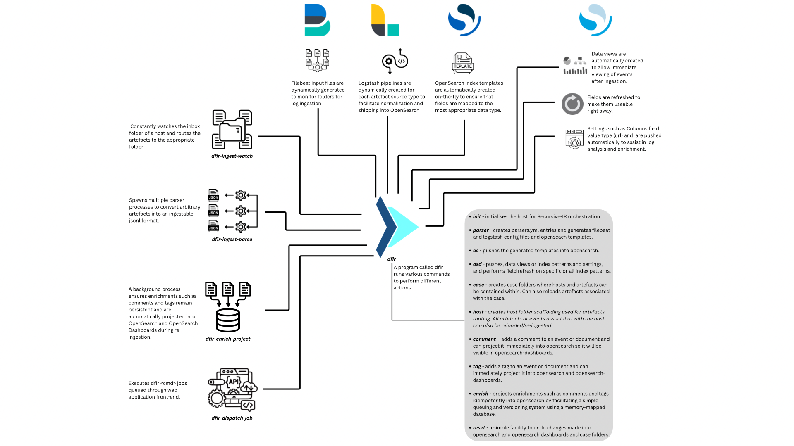

<p align="center">
  
</p>

Recursive-IR is a single-binary orchestration layer that transforms an OpenSearch stack into a fully capable and customisable DFIR log analytics platform.



Recursive-IR enables case-centric investigations with persistent enrichments such as tags, comments, and analyst context, while fully leveraging the strengths of OpenSearch and native OpenSearch Dashboards — scalable observability, visualisation, and Security Analytics for alerting and correlation across ingested forensic artefacts.

It can drive arbitrary parsers and facilitate log ingestion through dynamically generated parsing pipelines and mapping templates, allowing heterogeneous forensic data to be ingested safely and consistently.

Field normalisation (copying, renaming, restructuring) is defined declaratively, enabling schemas to evolve without hard-coding logic into ingestion pipelines.

Data-type conflicts and other ingestion issues are isolated into a dedicated index, with built-in facilities to correct mapping conflicts and seamlessly reload previously ingested data — ensuring investigations remain accurate, reproducible, and deterministic.

Recursive-IR is not a forensic artefact collection or live response tool. It focuses on orchestration, ingestion, normalisation, enrichment, and analysis of forensic data after collection, and is designed to integrate cleanly with existing acquisition workflows and tooling.

Rather than enforcing a fixed investigation model or interface, Recursive-IR provides a flexible analytics foundation that adapts to different DFIR workflows — enabling teams to shape investigations around their needs rather than conforming to a predefined tool workflow.

---

## Quickstart

Initialise the environment:

```bash
sudo ./bin/dfir init
