Author: <a href="https://www.linkedin.com/in/markjaysonalvarez" target="_blank">Mark Alvarez</a>

<a id="introduction"></a>
Recursive-IR is a single-binary orchestration that transforms an OpenSearch stack into a fully capable and customisable DFIR log analytics platform. Incident responders and digital forensics investigators can examine events arranged in a "super timeline" enabling correlation between different source artefacts to better understand the threat actor's full chain of attack.


It enables collaborative case-centric investigations with persistent enrichments such as tags, comments, and analyst context, while fully leveraging the strengths of OpenSearch and native OpenSearch Dashboards — scalable observability, visualisation, and Security Analytics for alerting and correlation across ingested forensics artefacts.

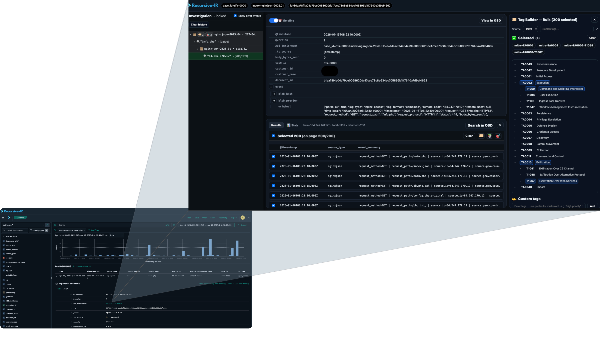

The platform offers full control over data being analysed with facilities to resolve data type mapping conflicts, mutating fields (e.g., renaming, copying, or stringifying), normalizing log sources with different timezones, and even selecting fields to be used as @timestamp.  

Artefacts can be reloaded or re-parsed and reloaded easily enabling users to perform modifications such as adding enrichments or mutating fields if needed, a feature which isn't commonly available in traditional SIEMs. 

# Table of Contents
* [1. Introduction](#introduction)
* [2. Features](#features)
* [3. QuickStart](#quickstart)
* [4. User Guide](#user-guide)
    * [4.1 Logging in to Recursive-IR](#user-login)
    * [4.2 Status Cards](#status-cards)
    * [4.3 Adding Parser Definitions](#new-parser)
    * [4.4 Creating a New Case](#new-case)
    * [4.5 Adding a New Host Into a Case](#new-host)
    * [4.6 Uploading Artefacts](#uploading-artefacts)
    * [4.7 Creating Users](#new-user)
    * [4.8 Customizing Columns](#customizing-columns)
    * [4.9 Selecting @timestamp Fields](#timestamp-fields)
    * [4.10 Mapping Fields and Resolving Conflicts](#mapping-fields)
    * [4.11 Resetting Recursive-IR](#resetting-recursive-ir)
    * [4.12 Reloading Case Artefacts](#reloading-artefacts)
    * [4.13 Re-syncing Recursive-IR](#resync-recursive-ir)
    * [4.14 Enriching Events](#enriching-events)
    * [4.15 Pivoting From an Event](#pivoting-event)
    * [4.16 The Investigation Pivot Tree](#pivot-tree)
* [5. Directory Layout](#directory-layout)
* [6. Systemd Units](#systemd-units)
* [7. Troubleshooting](#troubleshooting)
* [8. License](#license)
* [9. Reporting Issues](#reporting-issues)
---
<a id="features"></a>
# 2. Features 

## 2.1 Case Management and User Collaboration

* Case-centric investigations - Users can create one or more cases within the platform.
* One or more users can be created (e.g., if multiple analysts are working on the same case) and their access to case artefacts is scoped, allowing them to work only on artefacts within their assigned case(s).
* Case artefacts can be reloaded or re-parsed and reloaded anytime, such as when resolving field-mapping conflicts or during fields normalization. 

## 2.2 Artefacts Upload and Tracking

* Allows uploading of one or more artefacts into a target host within a case via a web interface or directly in the terminal.
* Large artefacts are chunked and uploads can be resumed if interrupted.
* Uploaded artefacts are automatically hashed for tracking and an inventory is created per host.
* Artefacts of the same file names can be uploaded multiple times and will be handled accordingly (i.e., will not result in duplicate entries).
* Supports uploading compressed artefacts.

## 2.3 Parallel Artefacts Parsing

* Orchestrate arbitrary parsers (e.g., hayabusa, dissect, plaso, evtx_dump,  etc.) to convert forensics artefacts into OpenSearch-ingestable jsonl format. 
* Configurable timezone for each source type for more accurate forensics timelining.
* Parser command lines are previewed in the UI so they can be tested directly in the terminal.
* Configurable @timestamp -  Fields that contain date and time that will be used as the @timestamp field can be configured per source type, otherwise, @timestamp defaults to ingestion time. This allows ingestion of practically any jsonl files, even those that don't have any date/time fields.

## 2.4 Log Ingestion and Normalization

* Dynamically generates filebeat input, logstash pipelines, and opensearch index template configuration files per source type. Users can customize these configuration files for any additional logic if needed.
* Idempotent log ingestion. One or more uploaded artefacts containing similar events will not result into duplicate documents in OpenSearch once ingested. Document "fingerprint" used is configurable per source type.
* Timezone normalization - @timestamp field of each ingested event is normalized into UTC timezone and an option to create an extra timestamp_TIMEZONE field(s) is available during case creation.
* Field normalization - Field data types are mapped into those in Elastic Common Schema (ECS) for known fields, and dynamically determined for the unknown ones. Any conflict can be resolved easily through field mappings configuration interface. 

## 2.5 Event Enrichments

* Add persistent enrichments to events in OpenSearch such as tags and comments and automatically project them into OpenSearch Dashboards persistently (i.e., enrichments survive re-parsing or reloading of artefacts).
* Group a specific set of events into "collections" and an easy toggle to add hand-picked events to the final investigation timeline.
* Intuitive user interface for event enrichments, marking indicators of compromise, and pivoting during artefacts analysis. All searches performed are automatically saved in a "pivot tree".
* Enrich each event with geo-location information. Recursive-IR uses its own MMDB-format IP Geolocation database generated from ipverse data at https://github.com/ipverse.

## 2.6 Sigma Rules Support

* Built-in support for sigma detection rules. Users can use Security Analytics plugin of OpenSearch Dashboards which comes with a number of detection rules for different source types, and create or import custom rules.


---
<a id="quickstart"></a>
# 3. 🚀 Quickstart

This guide walks you through a **fresh single-node installation** of Recursive-IR on any Ubuntu installation (tested on Ubuntu Server 24.03).

---

## 3.1 Clone Recursive-IR

```bash
sudo mkdir -p /opt && \
cd /opt && \
sudo git clone https://github.com/improvisec/recursive-ir.git && \
cd /opt/recursive-ir
```

---

## 3.2 Install  OpenSearch Stack and Recursive-IR 

Recursive-IR comes with an installer script that automates everything needed to bring up the whole stack. Running the script might take several minutes as it downloads the needed packages including the latest OpenSearch and OpenSearch Dashboards, Filebeat, and Logstash, as well as the Docker images for Recursive-IR's web UI, API, and Nginx containers. The admin password specified in the below command MUST be a strong one, otherwise, installation may not be successful (e.g., initial login to the platform may fail.)

```bash
sudo OPENSEARCH_INITIAL_ADMIN_PASSWORD='Recursive-IR-2026!' \
  ./scripts/install.sh
```

This installs and configures:

- OpenSearch, latest Ubuntu package (single-node, bound to `127.0.0.1`)
- OpenSearch Dashboards, latest Ubuntu package (loopback only)
- Logstash, latest Apache 2.0 licensed version
- Filebeat, lates Apache 2.0 licensed version
- Recursive IR Web UI container package
- Recursive IR Web API container package
- Nginx proxy container package
- "recursive" user account. Use ```sudo psaswd recursive``` to set its password. 

---

## 3.3 Verify Full Stack

Check system services:

```bash
systemctl status opensearch opensearch-dashboards logstash filebeat dfir-watcher dfir-parser.timer dfir-enricher.timer dfir-worker
```

Check Docker containers:

```bash
docker ps
```

Check OpenSearch:

```bash
sudo curl --cacert /etc/recursive-ir/certs/opensearch/root-ca.pem \
  -u admin:'Recursive-IR-2026!'\
  https://127.0.0.1:9200/_cluster/health?pretty
```

---

## 3.4 Installation Complete

Your Recursive-IR deployment now includes:

- Secure OpenSearch (loopback only)
- Log ingestion via Logstash + Filebeat
- Recursive-IR worker + enrichment engine
- FastAPI backend
- Recursive-IR web user interface
- nginx LAN gateway for controlled access

## 3.5 To Uninstall

To uninstall Recursive-IR, use the uninstall script. Review the details on the screen and hit 'q' when done. Then type 'y' when prompted and hit enter. The 'recursive' user can be manually removed if no longer needed.

```./scripts/uninstall.sh```


---
<a id="user-guide"></a>
# 4. 📘 User Guide

The Recursive-IR platform is mainly driven by an executable program called "dfir". All operations done via the web user interface will go through a "job" system where each job will be submitted to the appropriate backend API endpoint for queuing. This job will then be consumed and executed by a background systemd worker process called "dfir-worker" (which also runs the "dfir" executable). As such, all steps performed in the web interface as shown in this user guide, can also be executed directly on the terminal.

As of writing, Recursive-IR is actively being developed. For a list of all available dfir commands and parameters, type ```dfir``` or ```dfir [cmd] -h``` to see the corresponding help menu. 

---
<a id="user-login"></a>
## 4.1 Logging in to Recursive-IR Web User Interface

Using the admin username and password set during the installation, login to Recursive-IR for the first time by visiting: 

```bash
http://OSD_HOST_LAN/app/login?nextUrl=/recursive-ir
```
or just the below URL on succeeding logins.

```bash
http://OSD_HOST_LAN
```


OSD_HOST_LAN pertains to the first local network interface's IP address detected during installation. It should also be set automatically in ```/etc/recursive-ir/recursive.env```.  However, when deploying Recursive-IR on an AWS EC2 instance, the public IP address associated with the instance should be used instead so Recursive-IR can be accessed remotely (don't forget to restrict inbound traffic to port 80/443 though). Likewise, the same IP address should be set in recursive.env before uploading any artefacts so that all Add_Enrichment links will use the correct IP address (see Section 4.14). 
 
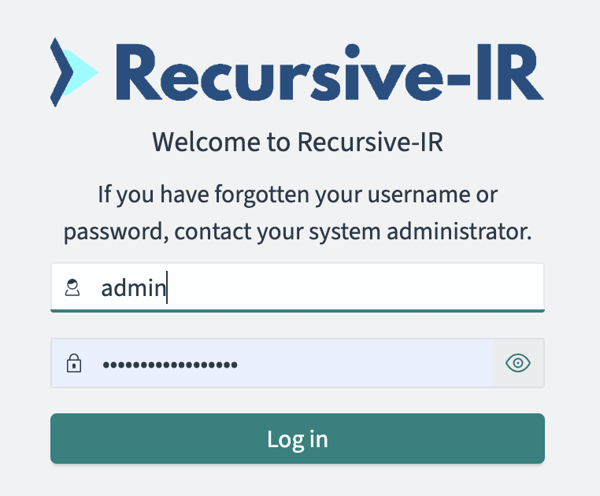

Once logged in, the web interface will show a number of sections for configuring Recursive-IR and performing various actions. The left panel containing these sections can be expanded/collapsed by clicking the "hamburger" menu at the top of the left panel.

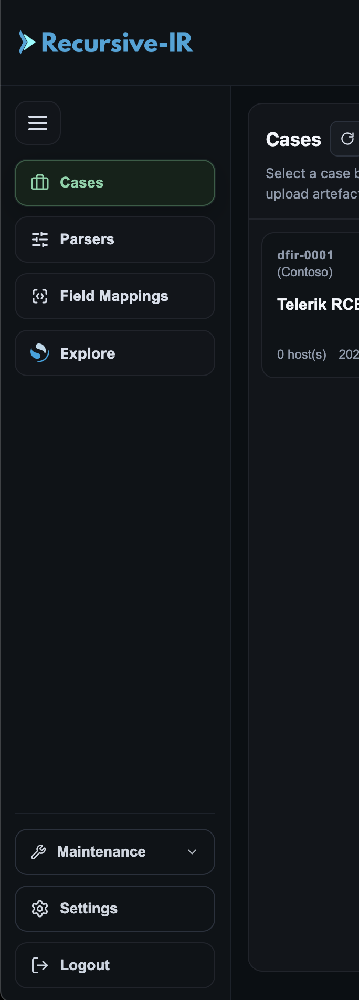

<a id="status-cards"></a>
## 4.2 Quick Steps Status Cards

A number of steps are involved before forensics artefacts can be analysed using Recursive-IR during an incident response investigation. These steps can be summarized as follows:

1. Definition of artefacts parsers.
2. Creation of cases and hosts, and uploading of raw artefacts.
3. Parsing of uploaded forensics artefacts and ingestion into an observability platform (i.e., OpenSearch).

A status card representing each step is shown in the main page which guides the user on what to do in sequential order. These cards are just clickable links to the section shortcuts on the left panel menu.

In Step #2 for example, the application will detect if there are any parsers already configured and enabled (Step #1) prior to creating new cases and uploading new artefacts. If there was none, the card remains disabled. Likewise, in Step #3, the application will detect if there are any ingested events already present for exploration and analysis, otherwise the card remains disabled. Shortcuts on the left panel are still clickable anytime regardless of the cards' status.

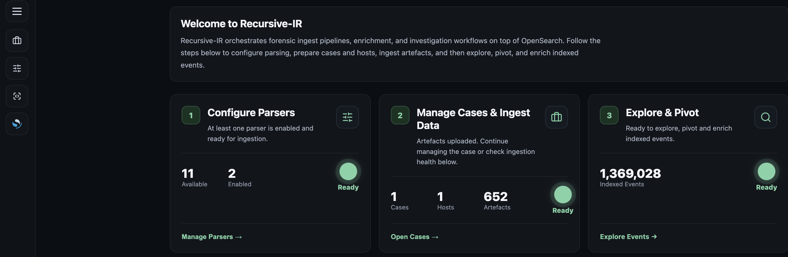

<a id="new-parser"></a>
## 4.3 Adding a New Parser Definition 

The first step in using the platform is adding new parser definitions. By default, Recursive-IR ships with a few sample parser definitions that can be enabled or disabled as needed. These parser definitions are only meant to show various ways on how to configure stand-alone parsers or create wrappers that can execute multiple programs in order to produce the final jsonl output needed for ingestion. 

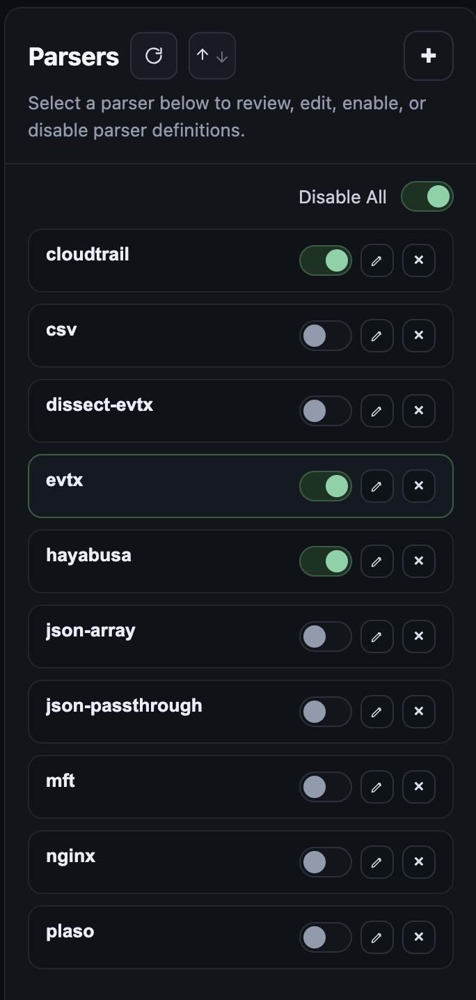

Patterns specified for each parser entry are used to determine if the dropped artefacts or artefact folders will be processed by the corresponding parser binary. This allows processing the same artefact using multiple parsers such as evtx_dump and hayabusa for parsing .evtx files. 

For example, the dissect framework uses a separate program called rdump to parse the output of target-query command and produce json files. By creating a script wrapper as shown below, one can combine target-query and rdump into a single executable that can be configured in the parser definition for parsing .evtx artefacts from a given raw artefact source. Note that the dissect python scripts used here were installed in "recursive" user's .venv folder. Recursive-IR doesn't normally ship with parser programs (except for a few Apache 2.0-licensed ones). Users should bring their own parsers into the platform.

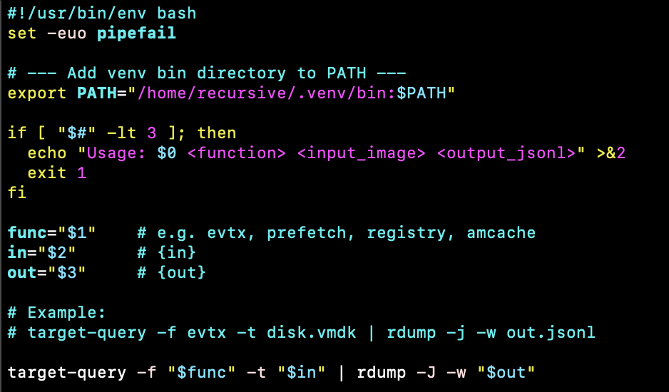

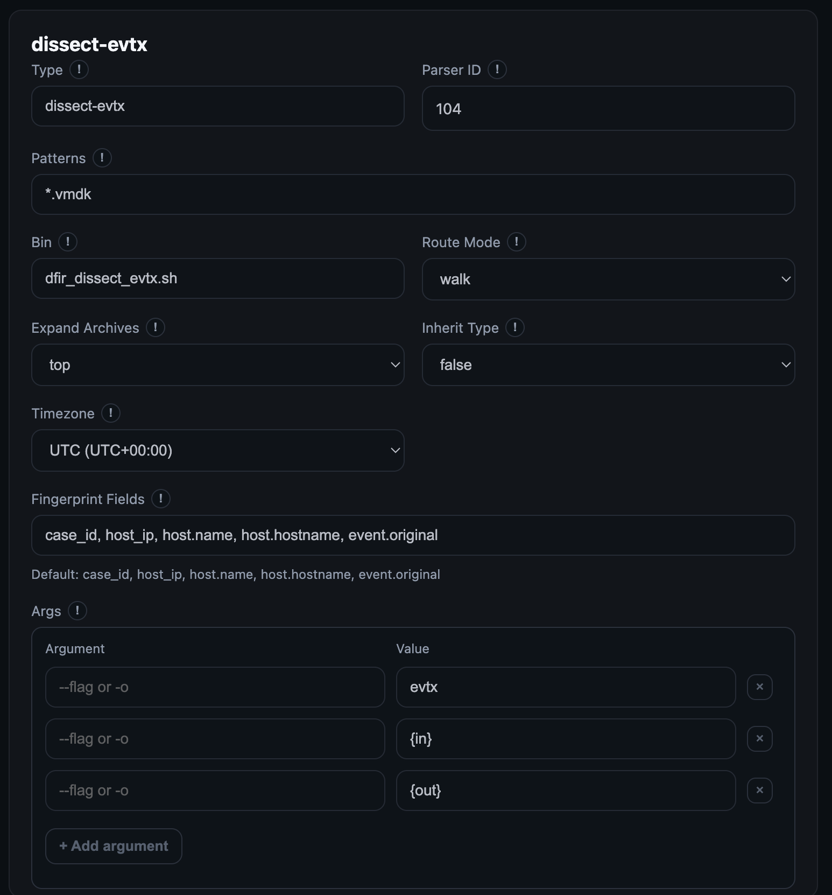

In another example below, given the huge number of individual log files involved when analysing AWS cloudtrail logs extracted from an S3 bucket, the ingestion pipeline might error out due to excessive open Filebeat file handles. By creating a wrapper script, not only that individual events can be extracted from 'Records' array within the log files, all events can also be written into a single jsonl file avoiding that excessive file handles scenario.

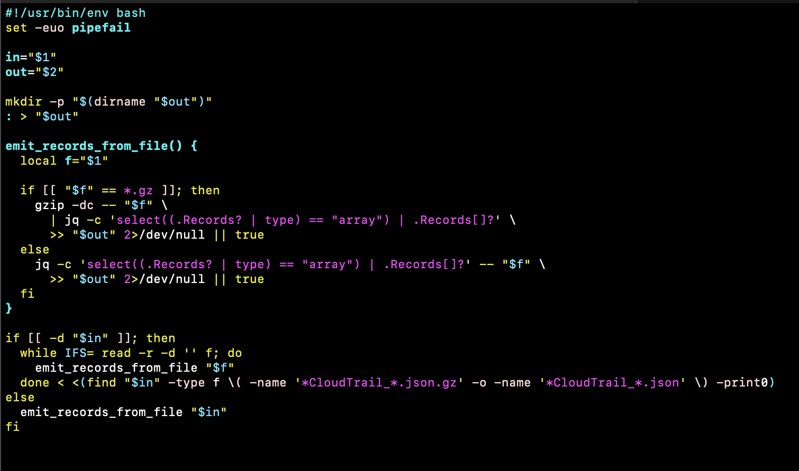

Parser entries can be copied or duplicated. This allows renaming a source type say "defender-device-timeline" as opposed to just plain csv.


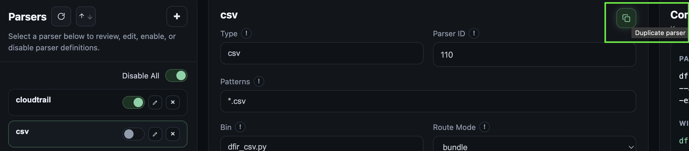

Parser definitions are straight forward. Parameters are specified on the left side, and the corresponding arguments or values are specified on the right. Parameters without any corresponding arguments can also be specified. 


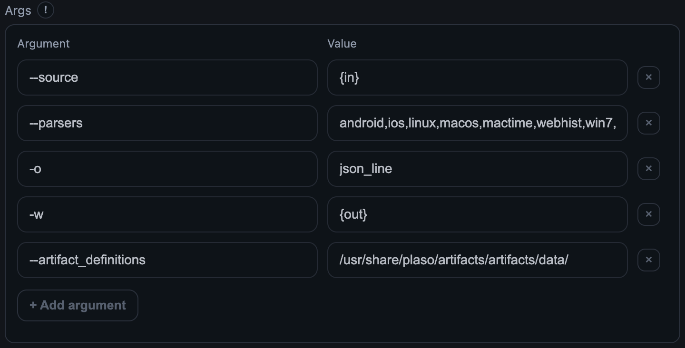

For every parser definition, two previews are shown on the right panel. One, for the dfir command that can be run in the command line (see below) to create the parser definition via the terminal, and two, the actual parser executable command that the dfir program will execute during log ingestion workflow. The second preview can be tested to ensure that the parser executable will produce the needed jsonl output file for ingestion.

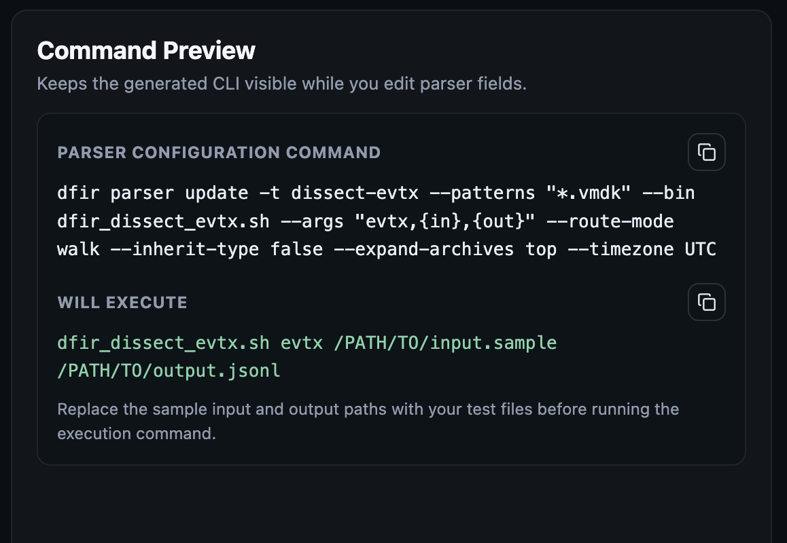

All parser definitions are written into the file:
```
/etc/recursive-ir/conf/parsers.yml
```
On the command line, an example parser command that adds a parser definition to convert EVTX logs into jsonl format is shown below:

```bash
dfir parser new -t evtx --patterns "*.evtx" --bin evtx_dump --args '-o,jsonl,--no-confirm-overwrite,-f,{out},{in}' -z AEST
```
The command above means that any file in *.evtx format shall be handled by the program evtx_dump (parsers can be found or put into bin/ folder of the recursive-ir repository for convenience). The command above will create the following entry in parsers.yml if it doesn't exist yet or unless -f or --force is specified, in which case, the parser definition will be overwritten for that particular source type.

```
  evtx:
    enabled: true
    patterns: ["*.evtx"]
    bin: evtx_dump
    args: ["-o", "jsonl", "--no-confirm-overwrite", "-f", "{out}", "{in}"]
    route_mode: walk
    inherit_type: false
    expand_archives: top
    timezone: AEST
    id: 100
```

### Parser Parameters:

- `enabled` - Whether the dfir-parser will activate the parser to perform jsonl conversion
- `patterns` - For individual files, globbing patterns are allowed. For artefacts inside folders, exact folder name must be specified
- `bin` - the name of the program to run to perform the parsing or jsonl conversion.
- `args` - a comma-separated list of arguments that the dfir-parser service will pass into the parser program when spawning it.
- `route_mode`: [walk|bundle] - whether the individual files will be recursively processed and fed into the parser program or the whole folder will be handed over.
- `inherit_type` - If a folder contains different types of artefacts, and you want to process them under a specific parsers.yml entry, set this to true. Otherwise, all parsers.yml entry that matches the patterns of each file will activate. For example, dropping an *.evtx will trigger both evtx_dump and hayabusa parsers.
- `expand_archives` - Automatically expand supported archives (tar/gz/zip).
- `timezone` - the timezone used by the events from this particular source type.
- `id` - an auto-generated parsers entry id.
- `{in}` - A placeholder that will be replaced by the artefact file/folder being parsed.
- `{out}` - A placeholder for output jsonl file (e.g., Security.evtx.jsonl)


After a parser entry is created, several things happen behind the scene. Configuration files such as filebeat input config files, logstash pipelines, and opensearch index templates, etc. are created dynamically. This allows recursive-ir to ingest practically any type of forensics artefacts as long as they are in jsonl format, without shipping any vendor-specific ingestion and normalization pipelines. The following files and folder contents are modified:

Parser definitions:
```
/etc/recursive-ir/conf/parsers.yml
```
Custom field mappings definition:
```
/etc/recursive-ir/conf/field-mappings.yml
```
Filebeat input configuration file:
```
/etc/recursive-ir/filebeat/inputs.d/<source_type>.yml
```
Logstash pipeline configuration files:
```
/etc/recursive-ir/logstash/pipelines.yml
/etc/recursive-ir/logstash/pipelines/nnn-<source_type>.conf
```
OpenSearch index template file:
```
/etc/recursive-ir/opensearch/templates/<source_type>-template.json
```
OpenSearch Dashboards columns file:
```
/etc/recursive-ir/opensearch-dashboards/columns.yml 
```
<a id="new-case"></a>
## 4.4 Creating a New Case
Events in the Recursive-IR can be grouped logically into different cases. Each event will have a case_id field that associates the event to a case and is used for scoping users' access. This allows forensics investigator and incident responders to work on multiple cases within the same deployment, although a dedicated box is still recommended for complete isolation. 

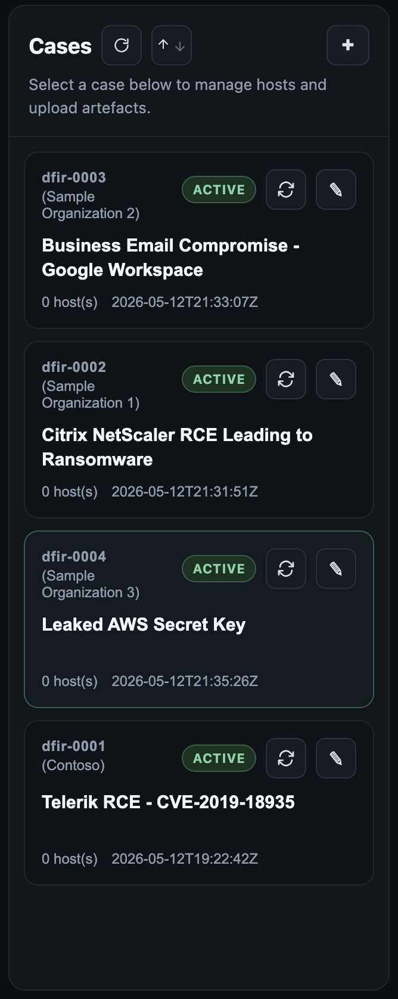

Create a case by accessing the Case Management page from the left panel menu. The fields to be filled in are pretty self explanatory. All events when ingested into OpenSearch will have their timestamps normalized into UTC timezone. Additional timestamp_TIMEZONE fields can be added to each event by selecting one or more timezones from the drop-down menu.

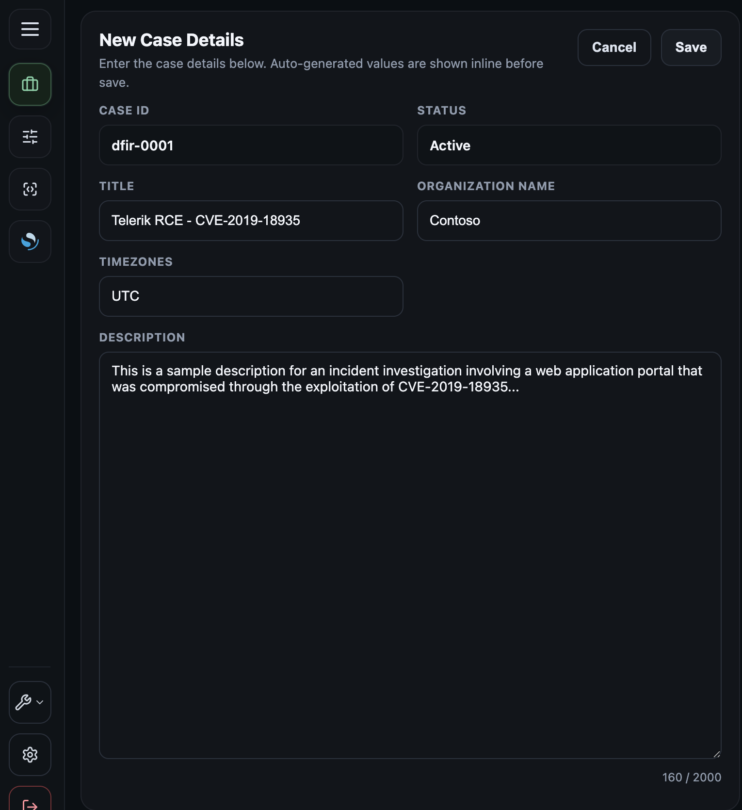

On the terminal, the following command creates a new case.

```bash
dfir case new -o "Contoso" -t "Entra compromise - March 2026" -d "Investigation of a business email compromise resulting from an attacker-in-the-middle attack" -z "AEDT"
```

This will:

- Create case folder structure inside ```/var/log/recursive-ir/cases/<case_id```
- Update the case_manifest.json to include all the details about the case. This case_manifest.json will aslo be ingested into OpenSearch under case-manifest-* data view in Discover.
```
/var/log/recursive-ir/cases/
└── dfir-nnnn/
    ├── hosts/
    ├── enrichments/
    └── case_manifest.json
```


---
<a id="new-host"></a>
## 4.5 Adding a New Host Into a Case

Once the case is created, the case creation panel enters into edit mode where further changes can be made or the panel can be dismissed. At this point, the host panel will also appear on the right where new hosts can be added to the case. A host is represented by IP address so that all artefacts belonging to the host can be uploaded into it. For artefacts coming from non-host sources like cloud, reserved IP address are used instead just for tracking. An IP address, a list of IP addresses, or CIDR subnets (with limits) can be specified during host creation.

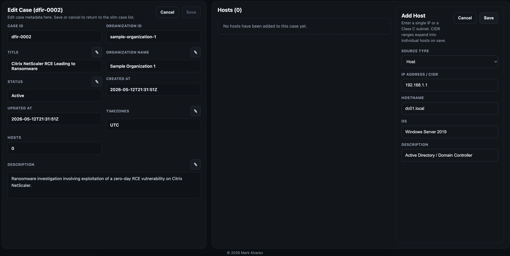

When done creating the hosts, dismiss the host creation panel by clicking on the cancel button to focus back on the host list panel. Hosts listed in the table can be sorted or each host can be edited where basic information such as description and operating system can be modified. Selecting any host will bring up the artefacts upload panel (next section).

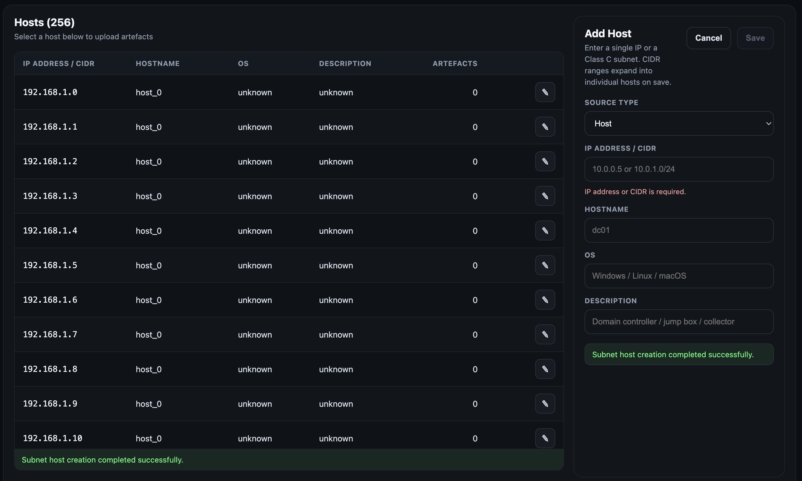

On the terminal, a new host can be added into a case using the command below.

```bash
dfir host add -c dfir-0001 --ip 192.168.0.1 --hostname host1.local --os Windows11 --description "Active Directory 1"
```

The command above will perform the following:

- Create the necessary directories for artefacts ingestion.
- Initialize a host manifest that will be ingested into OpenSearch.
- Display some instructions on how to manually drop artefacts into the host's inbox folder with the appropriate permissions.
```
/var/log/recursive-ir/cases/
└── dfir-0001/
    ├── hosts/
    │   └── 192.168.0.1/
    │       ├── inbox/
    │       ├── raw_artefacts/
    │       │   ├── [<source_type>/,...]
    │       ├── jsonified_artefacts/
    │       │   ├── [<source_type>/,...]
    │       └── host_manifest.json
    └── case_manifest.json
```

Below is the output when the command is ran in the terminal. 

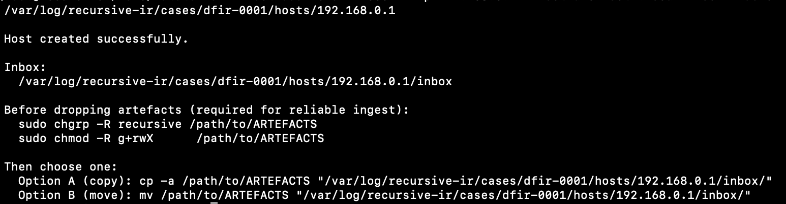

<a id="uploading-artefacts"></a>
## 4.6 Uploading Artefacts

Once the host has been created, artefacts can now be uploaded into that host's inbox folder via the web interface or directly in the terminal by placing them in this folder:

```
/var/log/recursive-ir/cases/<case_id>/hosts/<host_ip>/inbox/
```

On the web interface, select the host from the host list panel where artefacts will be uploaded into. This will bring up the artefacts upload panel. Artefacts can be selected for upload either by clicking the file or folder upload buttons and selecting the files, or by dragging and dropping the files into the artefacts upload panel.


When ready to upload the artefacts, hit the upload button to begin the upload process. Files bigger than 2GB will be chunked where uploads can be resumed if interrupted. Once upload is finished, these chunks will be merged before moving to the appropriate host inbox folder along with the other uploaded artefacts.

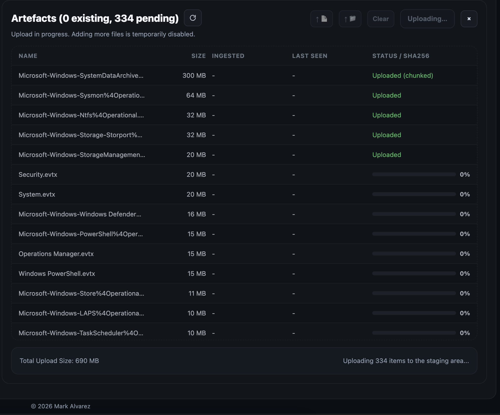

The upload staging folder can be found inside:

```
/var/lib/recursive-ir/web/uploads
```
Uploaded artefacts will be hashed and added to ```/var/log/recursive-artefacts_manifest.json


The dfir-watcher service automatically:

- Detects artefacts dropped into the inbox folder either directly (e.g., via cp or mv) or through the web ui.
- Routes them to the appropriate ```/var/log/recursive-ir/cases/<case_id>/hosts/<host_ip>/raw_artefacts/<source_type/``` folder according to the parsers.yml entries where dfir-parser service will parse them automatically.
- Maintain the folder hierarchy of dropped artefacts as much as possible.

The dfir-parser service will automatically:
- Detect artefacts dropped into the ```/var/log/recursive-ir/cases/<case_id>/hosts/<host_ip>/raw_artefacts/<source_type/``` folder.
- Spawn child processes to run and parse the artefacts according to the parsers.yml entries (hard-coded to 10 child processes as of writing).
- Write the resulting jsonl file into ```/var/log/recursive-ir/cases/<case_id>/hosts/<host_ip>/jsonified_artefacts/<source_type/```. Filebeat constantly monitors these folders, so it can hand over the events contained in the files to Logstash for normalization and ingestion into OpenSearch.
- Create an artefacts_manifest entry for every parsed artefact. This allows tracking of every artefact ingested into Recursive-IR (i.e., via artefacts-manifest-* data view). 

---
<a id="new-user"></a>
## 4.7 Creating Users

To allow collaborative investigations, additional users can be created by accessing the Users tab within the Settings Panel. During the user creation, one or more cases must be assigned to the user. The user can then be given "case_admin" role to further allow case-related operations (e.g., reloading artefacts, creating hosts, etc.). The password for the newly created user will be displayed briefly on the screen and will automatically disappear within 5 minutes. A new password can be regenerated anytime from within the same panel.

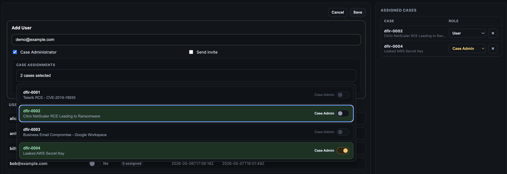

This user account will live within OpenSearch's internal database as an internal user. The assigned cases will be used to enforce "document-level security" where users will only have access to view events in OpenSearch or OpenSearch Dashboards within their assigned cases.

On the terminal, the following commands add a new user and prints the password on the screen:

```bash
  sudo dfir user create bob@example.com --print-password
```
```bash
  sudo dfir user assign bob@example.com --case dfir-0001 --role user
```

The commands above will:

- Create an OpenSearch internal user named 'bob@example.com'
- Authorize the user to access events enrichment UI and add enrichments to the OpenSearch events via "Add_Enrichment" fields in OpenSearch Dashboards Discover.
- Print the user's password on the terminal (optionally send via email (note: this feature is a work in progress but sending an email via Microsoft Entra-registered app is supported).

Note: Recursive-IR's Web UI and API lives on the same box as OpenSearch and OpenSearch Dashboards, hence, the authentication tokens are shared between them allowing seemless integration.

---
<a id="customizing-columns"></a>
## 4.8 Customizing Columns in OSD and Pivot Page

When exploring events in OpenSearch Dashboards, sometimes it is useful to have a pre-defined set of columns shown depending on which Log source type is being viewed. For example, an analyst would be interested to see the Computer, Channel, Provider, and Event ID of each evtxjson-* events. On the other hand, when viewing nginx or apache web server logs (e.g., nginxjson-*), one would be more interested in the request_method, request_path, source.ip, or source.geo.country_name. 


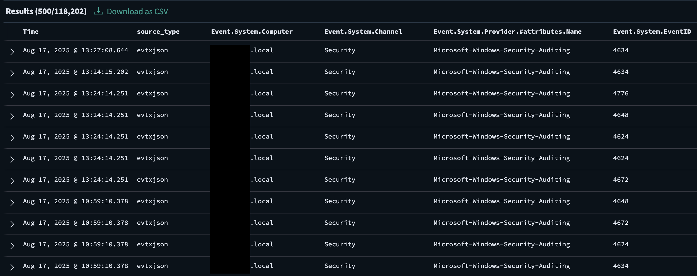

These columns can be customized per source type within the Settings page's Columns tab. Selecting a column/field will generate a realtime aggregation of values so the field values can be inspected if the field is worth adding in the default columns.

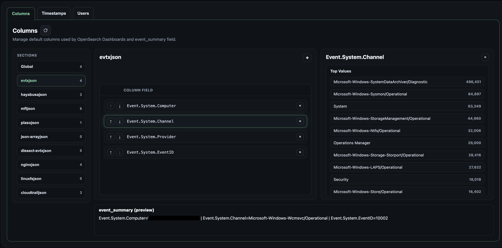

The fields grouped together will also form the event_summary field for the events in a given source type. This event_summary field is shown when exploring the search result in the Pivot page. The event_summary field is constructed during ingestion so case artefacts have to be reloaded or re-ingested for changes to take effect.

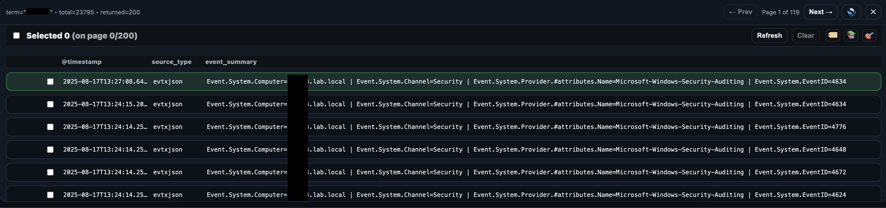

---
<a id="timestamp-fields"></a>
## 4.9 Selecting @timestamp Fields

When an event is ingested, Recursive-IR's logstash pipeline selects from a pre-defined list of fields that contain date and time. Some events will have multiple fields, for example, Windows MFT artefacts will have MACB timestamps. To change the preferred timestamp prioritization or order, re-arrange the timestamps list in the Settings panel's Timestamp tab. New fields can also be added to the list. If an event doesn't have any field in the list, the @timestamp field will be set to the ingestion time and a warning banner is displayed. To resolve this, inspect sample events from the selected index or data view to find a field that may contain date and time that can be used for the timestamp field.  

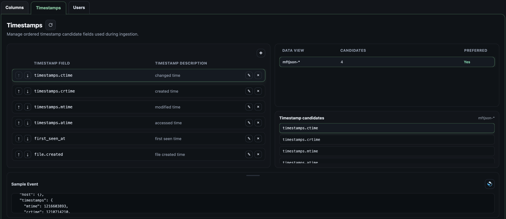

Clicking the banner will display the data views with event timestamps falling back to ingestion time. Selecting a data view loads sample events at the bottom where each can be inspected to identify fields that can be used for the @timestamp field such as Event.System.TimeCreated.#attributes.SystemTime in this example. Once the field is added to the list, reload the case artefacts to apply changes to the ingested data and all ingested events will use it as their @timestamp field. 

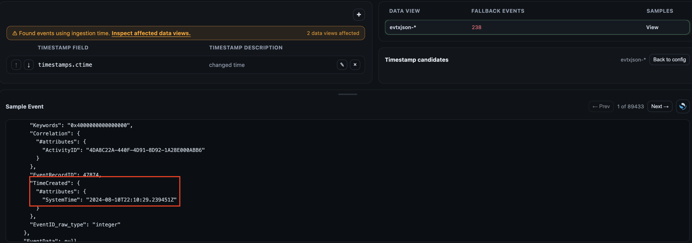

---

<a id="mapping-fields"></a>
## 4.10 Mapping Fields and Resolving Conflicts

In order to leverage OpenSearch's powerful search engine, events ingested should have fields mapped into their appropriate types. A string containing an IP address for example, when mapped to the "ip" data type, allows searching for IPs included in the same cidr subnet. Think of a scenario where you found an IP address indicator and you suspect that the threat actor uses other IPs in the same subnet.


When mapped as a "text", OpenSearch breaks down a field into separate tokens that enables lighting fast searches across millions of events. On the other hand, a field mapped as keyword allows aggregation searches where statistics can be retrieved (e.g., how many events have this value in the "request.url" field). Aggregations are used within the platform in several places such as when inspecting fields that can be used for @timestamp, or specifying additional search filters when pivoting from an event.

In general, correct data types allow applications to store them efficiently and perform operations on them that would otherwise have not been possible had they been mapped to the wrong type. An example would be the MaxMind geolocation database format (mmdb). IP addresses or subnets are stored and accessed in a special way that enables really fast IP address lookups as opposed to say storing subnets as plain texts or strings.  

Recursive-IR uses Elastic Common Schema to map known fields to the appropriate data types using a pre-defined field naming convention. The helper script below creates an OpenSearch index component template in ```/etc/recursive-ir/opensearch/templates/ecs-component.json``` corresponding to the fields in the ECS spreadsheet in ```/etc/recursive-ir/conf/ecs-fields.csv``` (retrieved from this url: https://raw.githubusercontent.com/elastic/ecs/refs/heads/main/generated/csv/fields.csv):

```
[repo_path]/scripts/gen_ecs_template.py
```

ecs-component.json is "imported" (i.e., via composed_of) into each index template generated per source type so each one inherits the mappings from this template.

OpenSearch supports dynamic mapping so it can automatically detect the most appropriate field type if not specified in the template. If a log file contains a field that isn't included in the ECS template that was created, its type is dynamically determined during ingestion. A problem arises when a log source has a field that has conflicting values. A tool for example can mix integers with strings such as "logon_type" having both "3" on some events and "3 - Network" on others. 

Once OpenSearch already mapped that field to an integer, succeeding events containing alpha-numeric values will be rejected. These ingestion errors will be logged by Logstash into its "dead letter queue" in ```/var/lib/recursive-ir/logstash/dead_letter_queue/```. Events in this log file is ingested into Recursive-IR OpenSearch under "ingestion-error-*" index where then can be inspected and resolved. To see the list of all conflicting fields, turn off "Hide missing fields" under "Filter by type" panel,  and "Visualize" and "Inspect" the field dlq.error_field.keyword (each field has a corresponding .keyword sub field that can be used for aggregation.)

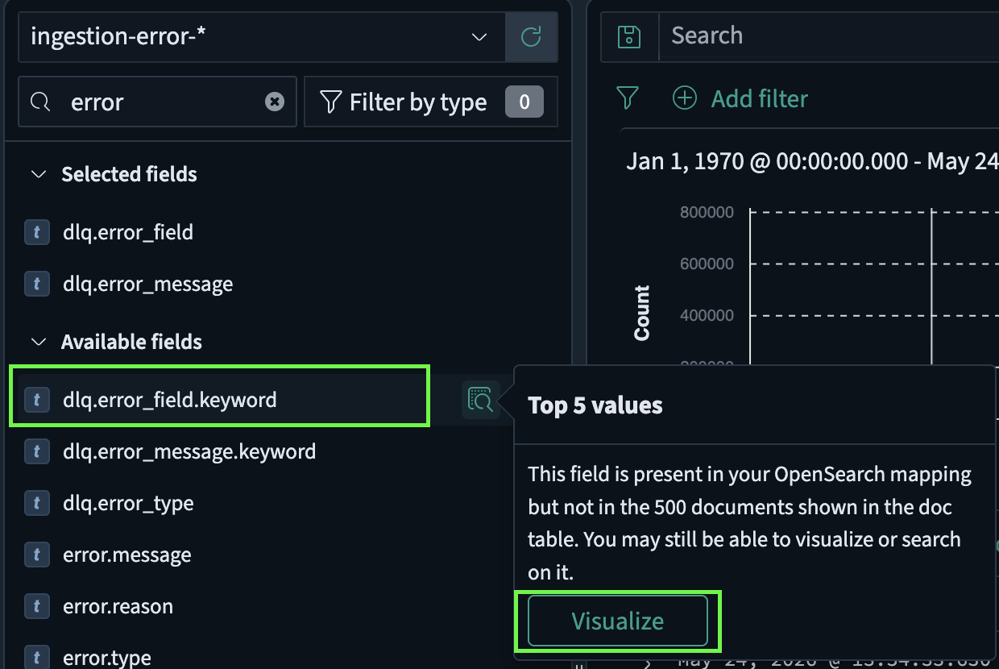

In the Recursive-IR homepage, when there are ingestion errors, clicking the Explore button will take you to the OpenSearch Dashboards Discover app where the default data view selected will be the "ingestion-error-" instead of "alljson-". The field that's causing the ingestion error can be inspected.

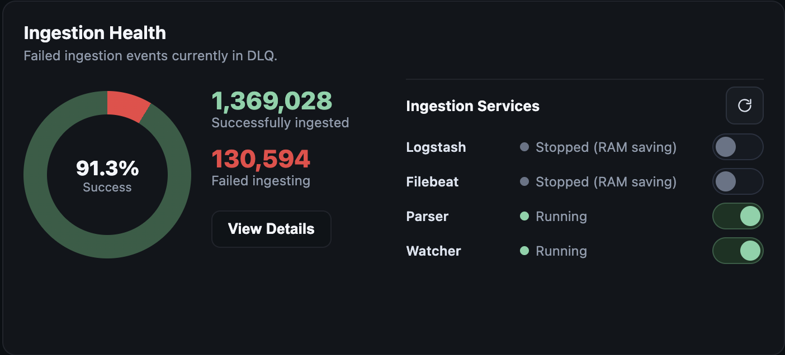

To resolve this, fields can be normalised via the Field Mappings page. Stringifying a field for example ensures that values are mapped to type text when events get ingested. 

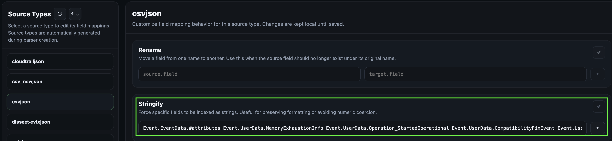

Once changes are saved, the indexed data along with the already stored dynamic mappings with conflicts has to be removed through the Maintenance panel and the case artefacts need to be re-ingested by performing a case reload through the Case Management page (see the next section).

---
<a id="resetting-recursive-ir"></a>
## 4.11 Resetting Recursive-IR

Recursive-IR offers a convenient way to purge already ingested data. This is useful when resolving ingestion data type mapping conflicts as mentioned in the previous section. The following options are available in the Maintenance panel:

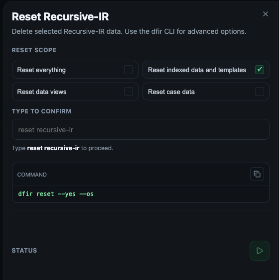

- ```Reset everything``` - Deletes OpenSearch indexed data, OpenSearch Dashboards data views, templates, and case folders.",
- ```Reset indexed data and templates``` - Deletes all OpenSearch indexed data including index and component templates.",
- ```Reset data views``` - Deletes OpenSearch Dashboards data views.
- ```Reset case data``` - Deletes case folders including uploaded artefacts and case-related indexed data. Defaults to all cases unless specific case IDs are provided.

For resolving mapping conflicts, 'Reset indexed data and templates" should suffice. Both "Reset everything" and "Reset indexed data" push the index templates, data views, and osd setttings again.  

---
<a id="reloading-artefacts"></a>
## 4.12 Reloading Case Artefacts

As mentioned in the introduction, users have full control over the data being ingested. This includes reloading already ingested case artefacts. For example, if one wants to change the field name SrcIpAddress to source.ip to enrich the events with geolocation information, this can be done within the Fields Mappings page as shown previously. To apply the changes, the case artefacts must be reloaded. Access the reload panel from within the Case Management page via the target case's reload button as shown below:

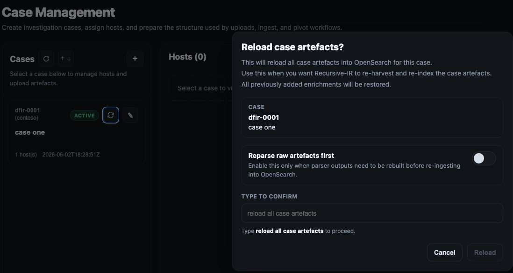

If one wants to just re-ingest the events into OpenSearch, plain reload is fine. However, if re-parsing is needed, an option is also available. Think of a scenario where the analyst decides to re-parse the artefacts using plaso after enabling additional plugins. In the command line, case artefacts can be reloaded using the following command:

```
dfir case reload -c dfir-0001 
```
or
```
dfir case reload -c dfir-0001 --reparse
```

---

<a id="resync-recursive-ir"></a>
## 4.13 Re-syncing Recursive-IR 

If for some reason, the index templates have been removed from OpenSearch, they can be re-pushed from ```/etc/recursive-ir/opensearch/templates``` folder via the Maintenance panel's ```Sync Recursive-IR```. This action also pushes data views and performs fields refresh (similar to clicking "Refresh fields list" from within the "Dashboards Management -> Index patterns -> [index]". OpenSearch dashboards settings such as default columns, dark theme, as well as Add_Enrichment URL-type value are also pushed.


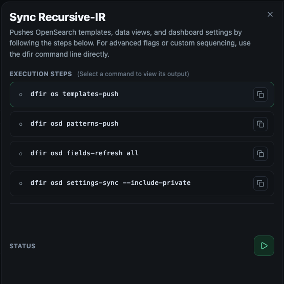

---

<a id="enriching-events"></a>
## 4.14 Enriching Events

Recursive-IR uses field value type "URL" to add a clickable link on the "Add_Enrichment" field, that when clicked, will take the user to the enrichment UI where the user can pivot from (e.g., perform additional searches after inspecting the event), add enrichments such as tags, comments, collections, IOCs, and timeline. 

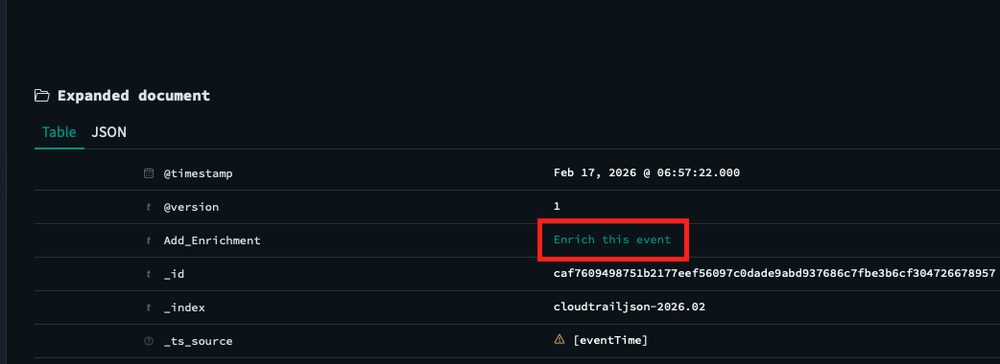

All enrichments will be created in the form of additional fields added into the OpenSearch event or document. The following fields contain these enrichments:

- ```tags``` - an array of strings. In the UI, pre-defined tags are created by creating .yml files in ```/etc/recursive-ir/conf/tags/```.  

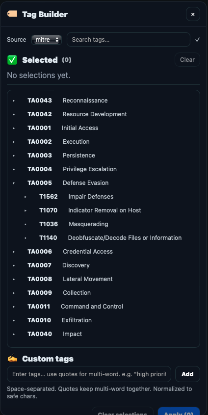

- ```event.iocs``` - an array of indicators of compromise (iocs)
IOCs can be marked by highlighting any string on the pivot event panel and accessing the right click context menu or clicking on any highlighted pills.

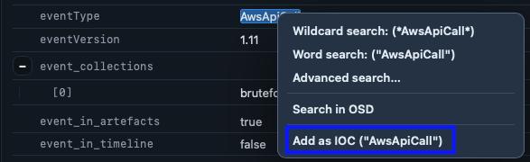

- ```event_collections``` - an array of collection names which the event is associated with. For example, a 1500+ failed logon events can be added to the collection "bruteforce_attacks" but only the initial, and successful ones are added into the Timeline. Instead of placing everything in the timeline (by toggling the "timeline" slider, see below), collections can be used to group related events. 

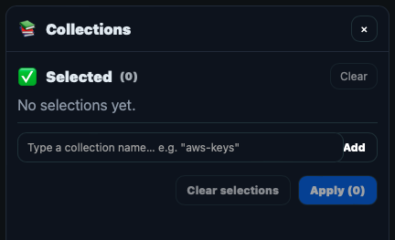

- ```event_in_timeline``` - created by toggling the "timeline" slider on the pivot event. This is useful for maintaining a highly currated list of events that ultimately go into the investigation's timeline. When investigation is over for example all events where event_in_timeline is true can be filtered.
  
- ```event_in_artefacts``` - system generated field that gets created depending on the user's enrichment actions (e.g., adding IOCs, adding to Timeline, etc.). If the analyst tags something or marks an IOC, or adds something in the timeline, it probably is related to the investigation, hence, automatically set event_in_artefacts field to true.

The Enrichment panel in the enrichment UI is located on the right side and shows the existing enrichments that were added to the event.

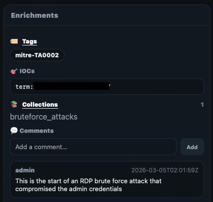

Certain enrichments can be added in bulk such as tags, iocs, and collections by accessing the enrichments button within the search panel. There is no limit to the number of events that can be enriched (e.g., when selecting "All events"). The dfir-enricher service performs enrichment in the background which the investigation continues.

---
<a id="pivoting-event"></a>
## 4.15 Pivoting From an Event

From Pivot event, a any string can be highlighted in order to access the search context menu (similar to when adding IOCs). The following explains the different search modes:

- Wildcard search (`.wc` fields) - A search for *search_term* anywhere in the field. This is the most accurate search but is slightly slower than word search. 
- Word search - A search for "search_term" using OpenSearch's text analysers where fields are broken down into tokens to perform lighting fast searches. This is achieved by creating a "reverse index" mapping each token into events where such token appears.
- OpenSearch Discover deep-link - Takes the user back to OpenSearch Dashboards' Discover to perform the search there.

Both wildcard and word searches can be performed in the advanced search modal:

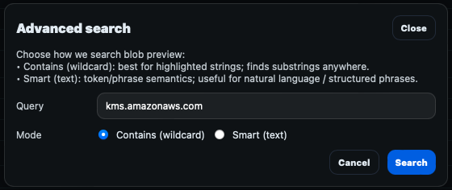

When a search is performed, the search panel results appear at the bottom and individual events can be selected to perform bulk enrichments action. To inspect the search results, an event_summary is displayed in the table. The fields included in the event_summary are constructed during the ingestion time by combining the fields specified in ```/etc/recursive-ir/opensearch-dashboards/columns.yml``` under a source_type entry. 

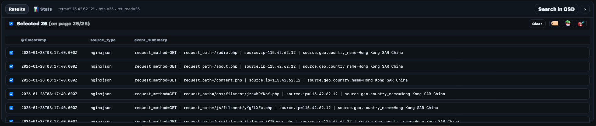

To make the search results more useable for analysis (e.g., to filter out noise in your data), access the stats panel by clicking on any field in the pivot event. This will bring up the Field Statistics panel where values can be filtered (include or exclude) and the search results will be updated immediately. All applied filters will be added to the "Filters" tab. 


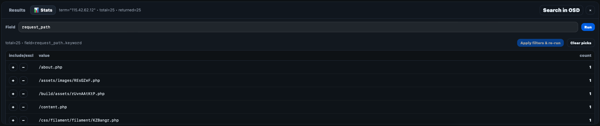

<a id="pivot-tree"></a>
## 4.16 The Investigation Pivot Tree

Hovering over to the left edge of the UI will bring out the Investigation tree. This is sort of like an automatically created breadcrumbs everytime a new pivot event is loaded or searches are performed. This tree keeps track of the analyst's investigation by logging what searches are performed, how a particular event was found, e.g., by pivoting from one event to another. In OpenSearch Dashboards, this could be similar to some degree to "saved searches", but without the user having to manually save anything. The tree can be cleared anytime as needed.


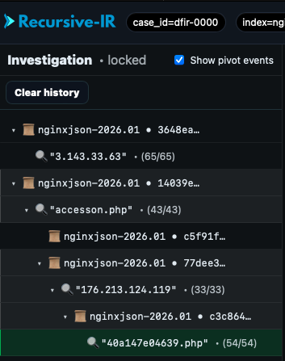


---
<a id="directory-layout"></a>
# 5. 📁 Directory Layout

## 5.1 OpenSearch

| Path | Purpose |
|------|---------|
| `/var/lib/opensearch/` | OpenSearch data directory |
| `/var/log/opensearch/` | OpenSearch logs |
| `/etc/opensearch/` | OpenSearch configuration |
| `/etc/recursive-ir/certs/opensearch/` | TLS certificates (CA, node, admin) |

OpenSearch listens on:

```
https://127.0.0.1:9200
```

---

## 5.2 OpenSearch Dashboards

| Path | Purpose |
|------|---------|
| `/etc/opensearch-dashboards/` | Dashboards configuration |
| `/var/log/opensearch-dashboards/` | Dashboards logs |

Dashboards listens on:

```
http://127.0.0.1:5601
```

External access is handled by nginx (accessible via OSD_HOST_LAN).

---

## 5.3 Logstash 

| Path | Purpose |
|------|---------|
| `/usr/share/logstash/` | Logstash binaries
| `/etc/recursive-ir/logstash/` | Recursive-IR Logstash pipelines + config |
| `/var/lib/recursive-ir/logstash/` | Logstash data + dead letter queue |
| `/var/log/recursive-ir/logstash/` | Logstash logs |

---

## 5.4 Filebeat 

| Path | Purpose |
|------|---------|
| `/usr/share/filebeat/` | Filebeat binaries
| `/etc/recursive-ir/filebeat/` | Recursive-IR Filebeat input files + config|
| `/var/lib/recursive-ir/filebeat/` | Filebeat registry/state |
| `/var/log/recursive-ir/filebeat/` | Filebeat logs |

---

## 5.5 Recursive-IR 

| Path | Purpose |
|------|---------|
| `/etc/recursive-ir/` | Main configuration directory |
| `/etc/recursive-ir/env/recursive.env` | Runtime environment configuration |
| `/etc/recursive-ir/filebeat` | Filebeat input configuration files |
| `/etc/recursive-ir/logstash` | Logstash pipeline configuration files |
| `/var/log/recursive-ir/cases/` | Main artefacts storage (raw + jsonl-converted |
| `/var/lib/recursive-ir/` | Jobs database |

---

## 5.6 TLS Certificates

All OpenSearch TLS materials are stored under:

```
/etc/recursive-ir/certs/opensearch/
```
---

## 5.7 Configuration Files

```
/etc/recursive-ir/conf
├── recursive.env
├── parsers.yml
├── field-mappings.yml
├── timestamps.yml
├── tags/xxx.yml

/etc/recursive-ir/
└── filebeat/inputs.d/
└── logstash/pipelines/
└── opensearch/templates
└── opensearch-dashboards/
```

## 5.8 Case Artefacts

```
/var/log/recursive-ir/cases/
└── <case_id>/
    ├── hosts/
    │   └── <host_ip>/
    │       ├── inbox/
    │       ├── raw_artefacts/
    │       ├── jsonified_artefacts/
    │       └── host_manifest.json
    │       └── artefacts_manifest.json
    └── enrichments
    └── case_manifest.json
```

---
<a id="systemd-units"></a>
#  6. Systemd Units 


- dfir-watcher - Watches for artefacts dropped into a host inbox folder:

```
 /var/log/recursive-ir/cases/<case_id>/hosts/<host_ip>/inbox
```
and routes them into:

```
 /var/log/recursive-ir/cases/<case_id>/hosts/<host_ip>/raw_artefacts/<source_type>
```

- dfir-parser - Watches files from the raw_artefacts/<source_type> folder above and runs corresponding parsers that will convert them into jsonl format. All jsonified_artefacts/<source_type> folders are monitored by Filebeat and jsonl files are fed into Logstash for OpenSearch Ingestion:

```
 /var/log/recursive-ir/cases/<case_id>/hosts/<host_ip>/jsonified_artefacts/<source_type>
```

- dfir-enricher - Runs periodically to see if there are any enrichments in the database that need to be projected into OpenSearch. This allows the enrichments such as tags and comments to persist (e.g., during case reloads).

```
/var/log/recursive-ir/cases/<case_id>/enrichments/data.mdb
```

- dfir-worker - Constaintly monitors the database for new jobs submitted via the API through the Web UI.

```
/var/lib/recursive-ir/web/jobs.db
```


---
<a id="troubleshooting"></a>
# 7. 🛠 Troubleshooting

Use the following commands below to view different logs:

Logs related to routing of raw artefacts from an inbox into a host's raw_artefacts folder:

```journalctl -u dfir-watcher -f```

To troubleshoot parsing related issues:

```journalctl -u dfir-parser -f```

To see the logs related to web UI actions handled by the worker process:

```journalctl -u dfir-worker -f```

To see web API related logs:

```sudo docker logs -f recursive-ir-api```

To see web UI related logs:

```sudo docker logs -f recursive-ir-ui```

To see debugging information in the terminal, set VERBOSE to 1 or set debugging level to 3 when running a command such as:

```VERBOSE=1 DFIR_HTTP_DEBUG=3 dfir osd patterns-push --include-private```


---

---
<a id="license"></a>
# 8. 📄 License

```
see LICENSE file inside recursive-ir repo.
```

---
<a id="reporting-issues"></a>
# 9. Reporting Issues 

Please use Github's Issues/Discussions tab or ping me on Discord: https://discord.gg/hYc7nPG9j

